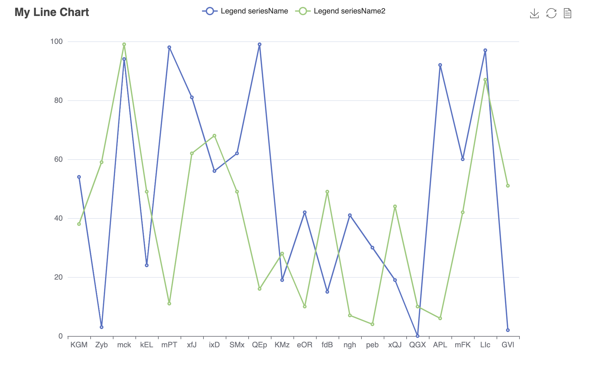

# echarts4j

*🍩 An inevitable charts library for Java.*

> Fairy tales are more than true: not because they tell us that dragons exist, but because they tell us that dragons can
> be beaten. —— Neil Gaiman, Coraline

TBH, I think use `Java` to build charts is a disaster
which should be struggling in the explicit typed hell.  
But it also makes me interest in how to make it close to the `loosely` (I don't mean
that you put all things as pure `Object`s :dog:).
After more experience on [Echarts](https://echarts.apache.org/), and know about many
tricks, I'm more curious about how to make it. Luckily, recently, time is available, so it comes here.

---

### 🔰 Installation

// TODO

### ✨ Features

* Smooth builder APIs.
* Highly configurable chart options.
* Closely to the full Echarts functions.
* Strong Extensibility.

---

### 📝 Usage

> Basic Chart


<details>
  <summary>Code</summary>

```
   Canvas.builder()
                .addCharts(LineChart.builder()
                        .options(ChartOption.builder()
                                .title(Title.builder()
                                        .text(chartTitle).build())
                                .legend(Legend.builder()
                                        .formatter(FuncStr.of(legendFormatter)).build())
                                .toolbox(Toolbox.builder()
                                        .showTitle(true)
                                        .feature(Toolbox.Feature.builder()
                                                .saveAsImage(Toolbox.SaveAsImage.builder().build())
                                                .restore(Toolbox.Restore.builder().build())
                                                .dataView(Toolbox.DataView.builder().build())
                                                .build())
                                        .build())
                                .xAxis(XAxis.builder()
                                        .data(x)
                                        .build())
                                .yAxis(YAxis.builder().build())
                                .build()
                                .addSeries(ListChartSeriesOption.builder()
                                        .name(seriesName)
                                        .data(data1)
                                        .build())
                                .addSeries(ListChartSeriesOption.builder()
                                        .name(seriesName2)
                                        .data(data2)
                                        .build())
                        )
                        .build())
                .build()
                .renderTo(new File("line.html"));

```

</details>

---
> Overlap Charts


<details>
  <summary>Code</summary>

```
        final String chartTitle = "My Overlap Charts";
        final String seriesName = "seriesName";
        final String seriesName2 = "seriesName2";
        final LineChart c = LineChart.builder()
                .options(ChartOption.builder()
                        .title(Title.builder()
                                .text(chartTitle).build())
                        .legend(Legend.builder().build())
                        .xAxis(XAxis.builder()
                                .data(x)
                                .build())
                        .yAxis(YAxis.builder().build())
                        .build()
                        .addSeries(ListChartSeriesOption.builder()
                                .name(seriesName)
                                .data(data1)
                                .build())
                        .addSeries(BarChartSeriesOption.builder()
                                .name(seriesName2)
                                .data(data2)
                                .build())
                )
                .build();

        final Canvas cvs = Canvas.builder()
                .addCharts(c)
                .build();
        final Render render = RenderProvider.get();
        render.render(cvs, new FileWriter("overlap.html"));

    }
```

</details>

---

> Dynamic Chart with Event and Action.


<details>
  <summary>Code</summary>

```
 final String chartTitle = "Dynamic Pie";
    final String seriesName = "Access Source";

    final List<String> legendData = Arrays.asList(
            "Direct Access",
            "Email Marketing",
            "Affiliate Ads",
            "Video Ads",
            "Search Engines"
    );

    final DataHelper dataHelper = DataHelper.create()
            .addValueField(Integer.class)
            .addNameField()
            .build()
            .addData(335, "Direct Access")
            .addData(310, "Email Marketing")
            .addData(234, "Affiliate Ads")
            .addData(135, "Video Ads")
            .addData(1548, "Search Engines");

    final List<String> center = Arrays.asList("50%", "60%");
    final PieChart p = PieChart.builder()
            .options(ChartOption.builder()
                    .animation(false)
                    .title(Title.builder()
                            .text(chartTitle)
                            .right("20")
                            .build())
                    .legend(Legend.builder()
                            .orient("vertical")
                            .left("left")
                            .data(legendData)
                            .build())
                    .build()
                    .addSeries(PieChartSeriesOption.builder()
                            .name(seriesName)
                            .radius("55%")
                            .center(center)
                            .data(dataHelper.get())
                            .build())
            )
            .build()
            .addJSFunction(FuncStr.of(actionWithEchartsInstance))
            .addListener("'click'", FuncStr.of(clickAlterFunc))
            .addListener("'legendselectchanged'", FuncStr.of(legendClickAlterFunc))
            .addListener("'mousemove'", FuncStr.of("{ dataIndex: 3 }"), FuncStr.of(mouseMoveAlterFunc));

        Canvas.builder()
                .addCharts(p)
        .build()
        .renderTo(new File("dynamic-pie.html"));
```

</details>

---

### 💡 Contribution

- New feature and bug fix are both great.
- Issue driven or PR driven is better.
- Options enrichment is highly welcome.

---

### 📃 License

MIT [©KoyZhuang](https://github.com/Koooooo-7/echarts4j/blob/main/LICENSE)