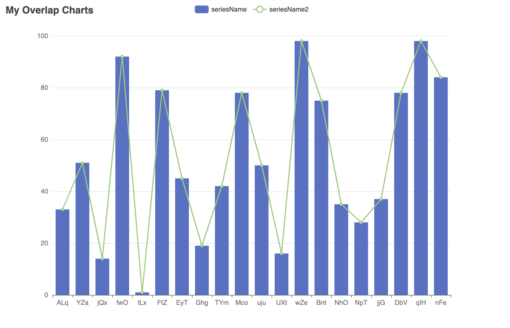

# echarts4j

[](https://jitpack.io/#Koooooo-7/echarts4j)
<a href="https://echarts.apache.org/" style="text-decoration: none;">

<a href="https://opensource.org/licenses/MIT" style="text-decoration: none;">


> Fairy tales are more than true: not because they tell us that dragons exist, but because they tell us that dragons can
> be beaten. —— Neil Gaiman, Coraline

To be honest, I believe using `Java` to build charts is a disaster, as it often feels like struggling in the explicit
typed hell, accompanied by lengthy lines of code.. However, it also piques my interest in finding ways to approach it
with a more loosely coupled mindset (not just dumping
everything as pure `Object`s 🐶). With increased experience in [Echarts](https://echarts.apache.org/) and discovering
various tricks, I've become even more curious about the possibilities. Fortunately, I now have the time to delve into
this further. *( contents polished by `ChartGPT-4`)*

---

### 🔰 Installation

> Support JDK8+ with `"JDK Sympathy"` (you do need upgrade it tho!)

It hosts on [jitpack](https://jitpack.io/#Koooooo-7/echarts4j/main-SNAPSHOT).

<details>
  <summary>Install via Gradle</summary>

```gradle
repositories {
    mavenCentral()
    // add the repository
    maven { url 'https://jitpack.io' }
}

dependencies {
implementation 'com.github.Koooooo-7.echarts4j:echarts4j-project:main-SNAPSHOT'
}

```

</details>

<details>
  <summary>Install via Maven</summary>

```pom
<repositories>
    <repository>
        <id>jitpack.io</id>
        <url>https://jitpack.io</url>
    </repository>
</repositories>
	
<dependency>
    <groupId>com.github.Koooooo-7.echarts4j</groupId>
    <artifactId>echarts4j-project</artifactId>
    <version>main-SNAPSHOT</version>
</dependency>
```

</details>

### ✨ Features

* Smooth builder APIs.
* Highly configurable chart options.
* Lots of beauty charts available.
* Closely to the full Echarts functionalities.
* Strong Extensibility.
* Live update support for displaying (see [echarts4j-chart-server](./echarts4j-chart-server/README.md)).
* Snapshot for image render (see [echarts4j-snapshot-playwright](./echarts4j-snapshot-playwright/README.md)).

---

### 📝 RunBook

In a nutshell, it generates [Echarts](https://echarts.apache.org/) options for the Echarts instance.
If you already familiar with [Echarts](https://echarts.apache.org/), you can quickly dive in.

- Take a quick look at the [Echarts Demos](https://echarts.apache.org/examples/en/index.html) to find what you need.
- Refer to the available [Echarts Options](https://echarts.apache.org/en/option.html#title) to understand how to
  configure.  
  (If it is missing in `echarts4j`, feel free to raise an Issue/PR :rocket:)

In general, there are three key aspects to understand about building an Echarts Chart:

- The `Canvas`, which contains all the charts and resources (`js, css...`), functioning similarly to an HTML page by
  default.
- The `Chart`, representing a Chart instance, with generic chart configurations, such as Title, Toolbox, and more.
- The `Series`, which resides within the Charts, where each type of Series indicates the underlying chart type.

```
|————————————  
|  Canvas   |  
|           |  
|  ——————   |  
|  | Chart  |  
|  |  ————  |  
|  |    |Series type=Bar |
|  |  ————  |  
|  |    |Series type=Line| 
|       (overlap different kinds of charts in one Chart)
|  |  ————  |  
|  |    |Series ... | 
|  |  ————  |  
|  ——————   |
| Charts...|
|  ——————   |
|  ——————   |
|  ——————   |
 ———————————

```

---

### 📊 How to

> Basic Chart


<details>
  <summary>Code</summary>

```
   Canvas.builder()
                .addCharts(LineChart.builder()
                        .options(ChartOption.builder()
                                .title(Title.builder()
                                        .text(chartTitle).build())
                                .legend(Legend.builder()
                                        .formatter(FuncStr.of(LiquidFillChart)).build())
                                .toolbox(Toolbox.builder()
                                        .showTitle(true)
                                        .feature(Toolbox.Feature.builder()
                                                .saveAsImage(Toolbox.SaveAsImage.builder().build())
                                                .restore(Toolbox.Restore.builder().build())
                                                .dataView(Toolbox.DataView.builder().build())
                                                .build())
                                        .build())
                                .xAxis(XAxis.builder()
                                        .data(x)
                                        .build())
                                .yAxis(YAxis.builder().build())
                                .build()
                                .addSeries(ListChartSeriesOption.builder()
                                        .name(seriesName)
                                        .data(data1)
                                        .build())
                                .addSeries(ListChartSeriesOption.builder()
                                        .name(seriesName2)
                                        .data(data2)
                                        .build())
                        )
                        .build())
                .build()
                .renderTo(new File("line.html"));

```

</details>

---
> Overlap Charts


<details>
  <summary>Code</summary>

```
        final String chartTitle = "My Overlap Charts";
        final String seriesName = "seriesName";
        final String seriesName2 = "seriesName2";
        final LineChart c = LineChart.builder()
                .options(ChartOption.builder()
                        .title(Title.builder()
                                .text(chartTitle).build())
                        .legend(Legend.builder().build())
                        .xAxis(XAxis.builder()
                                .data(x)
                                .build())
                        .yAxis(YAxis.builder().build())
                        .build()
                        .addSeries(ListChartSeriesOption.builder()
                                .name(seriesName)
                                .data(data1)
                                .build())
                        .addSeries(BarChartSeriesOption.builder()
                                .name(seriesName2)
                                .data(data2)
                                .build())
                )
                .build();

        final Canvas cvs = Canvas.builder()
                .addCharts(c)
                .build();
        final Render render = RenderProvider.get();
        render.render(cvs, new FileWriter("overlap.html"));

    }
```

</details>

---

> Dynamic Chart with Event and Action.


<details>
  <summary>Code</summary>

```
 final String chartTitle = "Dynamic Pie";
    final String seriesName = "Access Source";

    final List<String> legendData = Arrays.asList(
            "Direct Access",
            "Email Marketing",
            "Affiliate Ads",
            "Video Ads",
            "Search Engines"
    );

    final DataHelper dataHelper = DataHelper.create()
            .addValueField(Integer.class)
            .addNameField()
            .build()
            .addData(335, "Direct Access")
            .addData(310, "Email Marketing")
            .addData(234, "Affiliate Ads")
            .addData(135, "Video Ads")
            .addData(1548, "Search Engines");

    final List<String> center = Arrays.asList("50%", "60%");
    final PieChart p = PieChart.builder()
            .options(ChartOption.builder()
                    .animation(false)
                    .title(Title.builder()
                            .text(chartTitle)
                            .right("20")
                            .build())
                    .legend(Legend.builder()
                            .orient("vertical")
                            .left("left")
                            .data(legendData)
                            .build())
                    .build()
                    .addSeries(PieChartSeriesOption.builder()
                            .name(seriesName)
                            .radius("55%")
                            .center(center)
                            .data(dataHelper.get())
                            .build())
            )
            .build()
            .addJSFunction(FuncStr.of(actionWithEchartsInstance))
            .addListener("'click'", FuncStr.of(clickAlterFunc))
            .addListener("'legendselectchanged'", FuncStr.of(legendClickAlterFunc))
            .addListener("'mousemove'", FuncStr.of("{ dataIndex: 3 }"), FuncStr.of(mouseMoveAlterFunc));

        Canvas.builder()
                .addCharts(p)
        .build()
        .renderTo(new File("dynamic-pie.html"));
```

</details>

---

### 🚀 Contribution

- New feature and bug fix are both great.
- Issue driven or PR driven is better.
- Options enrichment is highly welcome.

---

### 🎉 Special Thanks

Gratitude to all outstanding projects/libraries for their contributions in echarts4j.

### 📃 License

MIT [©KoyZhuang](https://github.com/Koooooo-7/echarts4j/blob/main/LICENSE)