# echarts4j

[](https://jitpack.io/#Koooooo-7/echarts4j/main-SNAPSHOT)


[](https://javadoc.jitpack.io/com/github/koooooo-7/echarts4j/echarts4j-project/main-SNAPSHOT/javadoc/index.html)


> Fairy tales are more than true: not because they tell us that dragons exist, but because they tell us that dragons can
> be beaten. —— Neil Gaiman, Coraline

#### 如果说你需要一个生成图表的Java库，可以试试看echarts4j。 🍉

[README English](./README.md)

### 🔰 安装

> 支持 JDK8+ (别再停留在万年JDK8了...)

项目在 [jitpack](https://jitpack.io/#Koooooo-7/echarts4j/main-SNAPSHOT)上,
你可以使用 `main-SNAPSHOT` 来获得最新的版本，或者使用锁定的最新版本通过`tag`或者commit。
[](https://jitpack.io/#Koooooo-7/echarts4j)
.

<details>
  <summary>Gradle项目导入</summary>

```gradle
repositories {
    mavenCentral()
    // add the repository
    maven { url 'https://jitpack.io' }
}

dependencies {
   implementation 'com.github.Koooooo-7.echarts4j:echarts4j-project:v1.0.0'
}

```

</details>

<details>
  <summary>Maven项目导入</summary>

```pom
<repositories>
    <repository>
        <id>jitpack.io</id>
        <url>https://jitpack.io</url>
    </repository>
</repositories>
	
<dependency>
    <groupId>com.github.Koooooo-7.echarts4j</groupId>
    <artifactId>echarts4j-project</artifactId>
    <version>v1.0.0</version>
</dependency>
```

</details>

### ✨ Features

* 丝滑的 builder APIs。
* 高可配置性（依托于Echarts)。
* 高扩展性，实现Echarts更多功能。
* 支持动态更新展示图表 ([echarts4j-chart-server](./echarts4j-chart-server/README.md)).
* 支持渲染成图片 ([echarts4j-snapshot-playwright](./echarts4j-snapshot-playwright/README.md)).

### 🎨 Showcase

<div align="center">
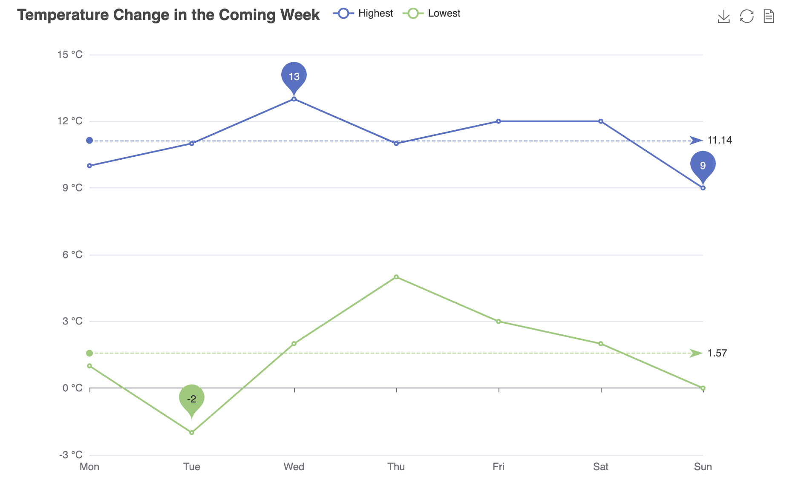

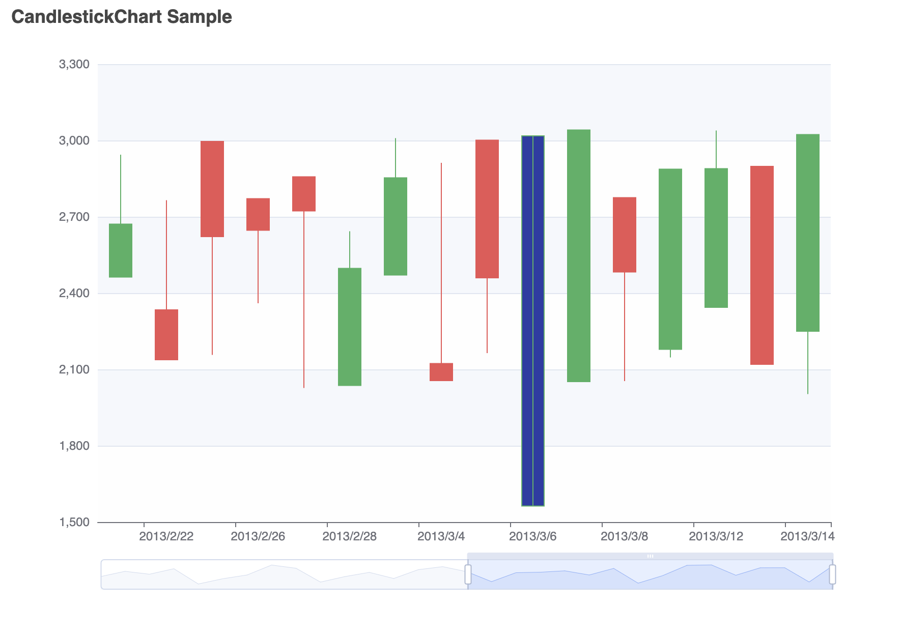

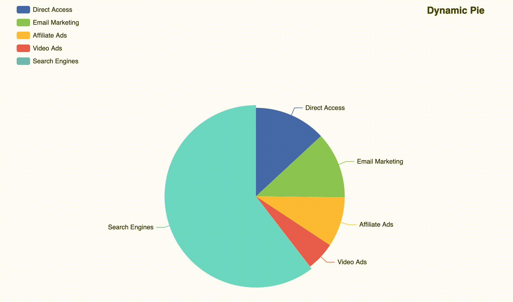
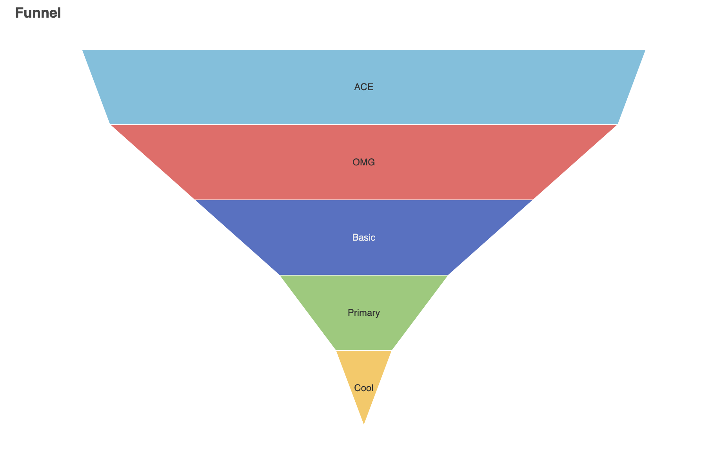
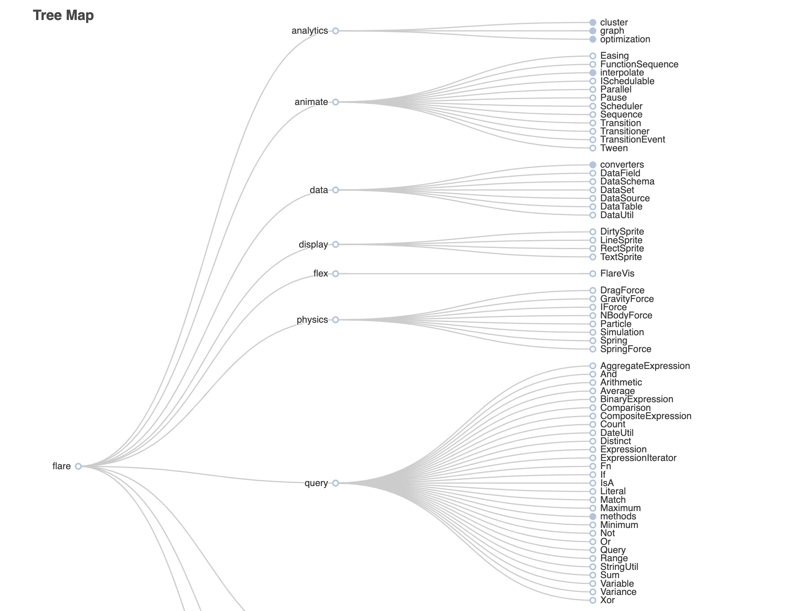
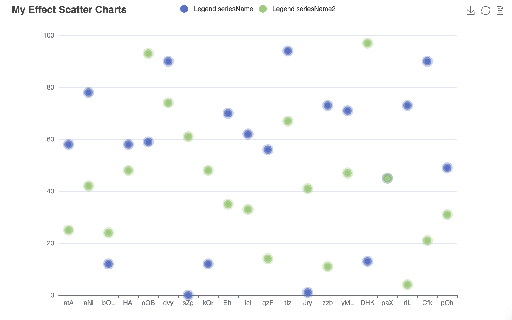
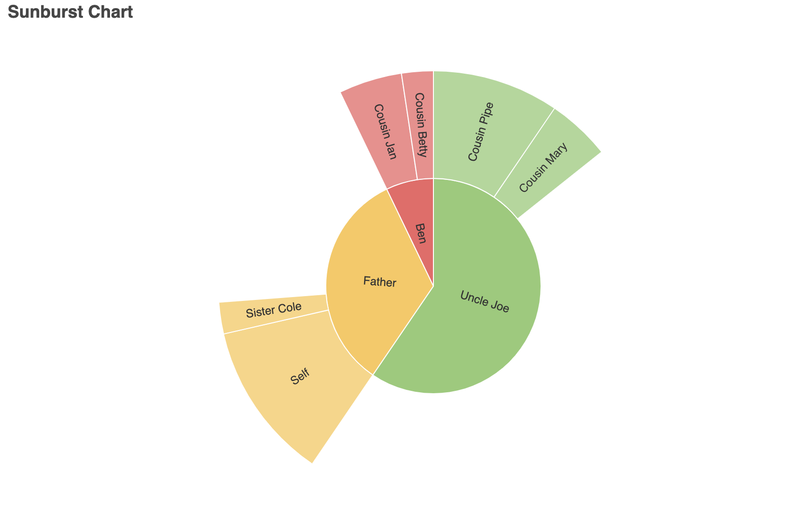
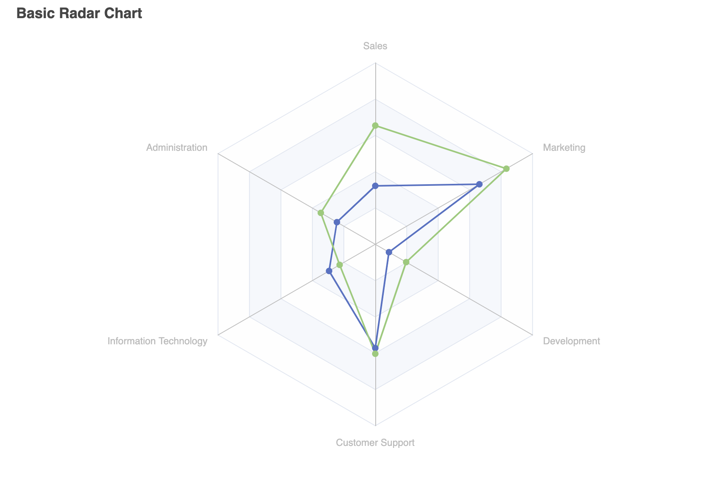
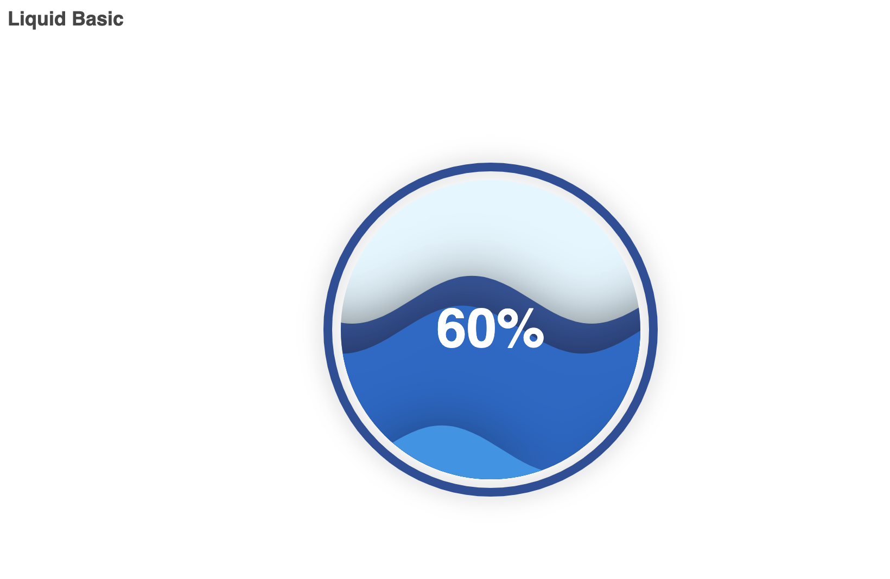
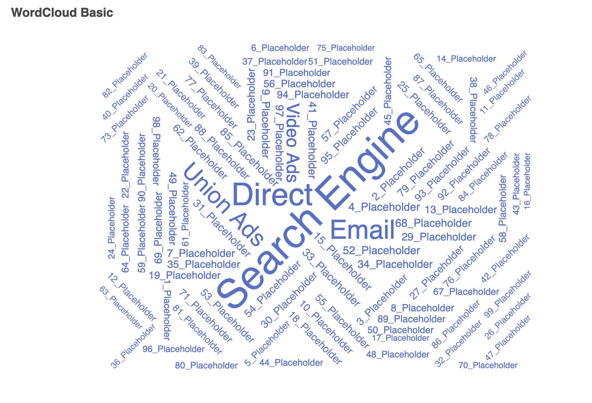
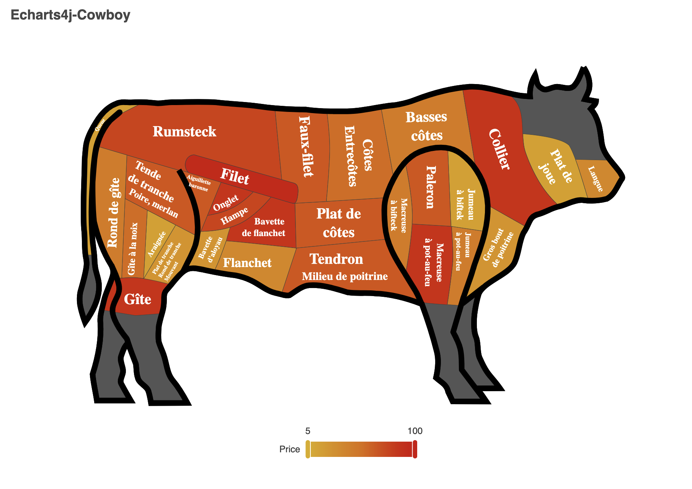
</div>
---

### 📝 RunBook

简而言之, 就是生成 [Apache Echarts](https://echarts.apache.org/) 所需要的配置。
如果你过一下 [Echarts](https://echarts.apache.org/)的文档，就可以很快上手了。

- 比如去 [Echarts Demos](https://echarts.apache.org/examples/en/index.html) 找一个图表，看看它的配置组成部分.
- 在这些配置中 [Echarts Options](https://echarts.apache.org/en/option.html#title) 知道有哪些配置可以使用。
  (如果有配置在 `echarts4j` 中缺失, 欢迎提交 Issue/PR :rocket:)

在 `echarts4j`中有3个主要的对象:

- `Canvas`, 代表了承载了图表的基础容器，比如HTML页面，即默认最终的渲染结果。
- `Chart`, 代表的就是一个图表实例，主要就是规定了它的类型，并配置`ChartOptions`。
- `Series`, 代表了对应的`series`的配置部分。

```
|————————————  
|  Canvas   |  
|           |  
|  ——————   |  
|  | Chart  |  
|  |  ————  |  
|  |    |Series type=Bar |
|  |  ————  |  
|  |    |Series type=Line| 
|       (overlap different kinds of charts in one Chart)
|  |  ————  |  
|  |    |Series ... | 
|  |  ————  |  
|  ——————   |
| Charts...|
|  ——————   |
|  ——————   |
|  ——————   |
 ———————————

```

---

### 📊 使用示例

> Basic Chart


<details>
  <summary>Code</summary>

```
        final String chartTitle = "My First echarts4j Bar";
        final String legendFormatter = "'Top: {name}'";
        final String seriesName = "Cole";
        final String seriesName2 = "Peps";

        try {
            Canvas.builder()
                    .addCharts(BarChart.builder()
                            .options(ChartOption.builder()
                                    .title(Title.builder()
                                            .text(chartTitle).build())
                                    .legend(Legend.builder()
                                            .formatter(FuncStr.of(legendFormatter)).build())
                                    .toolbox(Toolbox.builder()
                                            .showTitle(true)
                                            .feature(Toolbox.Feature.builder()
                                                    .saveAsImage(Toolbox.SaveAsImage.builder().build())
                                                    .restore(Toolbox.Restore.builder().build())
                                                    .dataView(Toolbox.DataView.builder().build())
                                                    .build())
                                            .build())
                                    .xAxis(XAxis.builder()
                                            .data(x)
                                            .build())
                                    .yAxis(YAxis.builder().build())
                                    .build()
                                    .addSeries(BarChartSeries.builder()
                                            .name(seriesName)
                                            .data(data1)
                                            .markLine(MarkLine.builder()
                                                    .data(Arrays.asList(MarkLine.MarkLineDataItem.builder()
                                                                    .name("The Max")
                                                                    .type("max")
                                                                    .build(),
                                                            MarkLine.MarkLineDataItem.builder()
                                                                    .name("The Min")
                                                                    .type("min")
                                                                    .build()))
                                                    .build())
                                            .build())
                                    .addSeries(BarChartSeries.builder()
                                            .name(seriesName2)
                                            .data(data2)
                                            .build())
                            )
                            .build())
                    .build()
                    .renderTo(new File("bar.html"));

```

</details>

---
> Overlap Charts


<details>
  <summary>Code</summary>

```
        final String chartTitle = "My Overlap Charts";
        final String seriesName = "seriesName";
        final String seriesName2 = "seriesName2";
        final LineChart c = LineChart.builder()
                .options(ChartOption.builder()
                        .title(Title.builder()
                                .text(chartTitle).build())
                        .legend(Legend.builder().build())
                        .xAxis(XAxis.builder()
                                .data(x)
                                .build())
                        .yAxis(YAxis.builder().build())
                        .build()
                        .addSeries(ListChartSeries.builder()
                                .name(seriesName)
                                .data(data1)
                                .build())
                        .addSeries(BarChartSeries.builder()
                                .name(seriesName2)
                                .data(data2)
                                .build())
                )
                .build();

        final Canvas cvs = Canvas.builder()
                .addCharts(c)
                .build();
        final Render render = RenderProvider.get();
        render.render(cvs, new FileWriter("overlap.html"));

    }
```

</details>

---

> Dynamic Chart with Event and Action.


<details>
  <summary>Code</summary>

```
 final String chartTitle = "Dynamic Pie";
    final String seriesName = "Access Source";

    final List<String> legendData = Arrays.asList(
            "Direct Access",
            "Email Marketing",
            "Affiliate Ads",
            "Video Ads",
            "Search Engines"
    );

    final DataHelper dataHelper = DataHelper.create()
            .addValueField(Integer.class)
            .addNameField()
            .build()
            .addData(335, "Direct Access")
            .addData(310, "Email Marketing")
            .addData(234, "Affiliate Ads")
            .addData(135, "Video Ads")
            .addData(1548, "Search Engines");

    final List<String> center = Arrays.asList("50%", "60%");
    final PieChart p = PieChart.builder()
            .options(ChartOption.builder()
                    .animation(false)
                    .title(Title.builder()
                            .text(chartTitle)
                            .right("20")
                            .build())
                    .legend(Legend.builder()
                            .orient("vertical")
                            .left("left")
                            .data(legendData)
                            .build())
                    .build()
                    .addSeries(PieChartSeries.builder()
                            .name(seriesName)
                            .radius("55%")
                            .center(center)
                            .data(dataHelper.get())
                            .build())
            )
            .build()
            .addJSFunction(FuncStr.of(actionWithEchartsInstance))
            .addListener("'click'", FuncStr.of(clickAlterFunc))
            .addListener("'legendselectchanged'", FuncStr.of(legendClickAlterFunc))
            .addListener("'mousemove'", FuncStr.of("{ dataIndex: 3 }"), FuncStr.of(mouseMoveAlterFunc));

        Canvas.builder()
                .addCharts(p)
        .build()
        .renderTo(new File("dynamic-pie.html"));
```

</details>

---

### 🚀 Contribution

- 新的特性个功能，或者bug修复都欢迎！
- 通过Issue或者PR来drive更好。
- 亟待增加/修正配置项目贡献。

---

### 🎉 Special Thanks

感谢所有`echarts4j`依赖的优秀的开源项目。

### 📃 License

Apache-2.0 license [©KoyZhuang](https://github.com/Koooooo-7/echarts4j/blob/main/LICENSE)